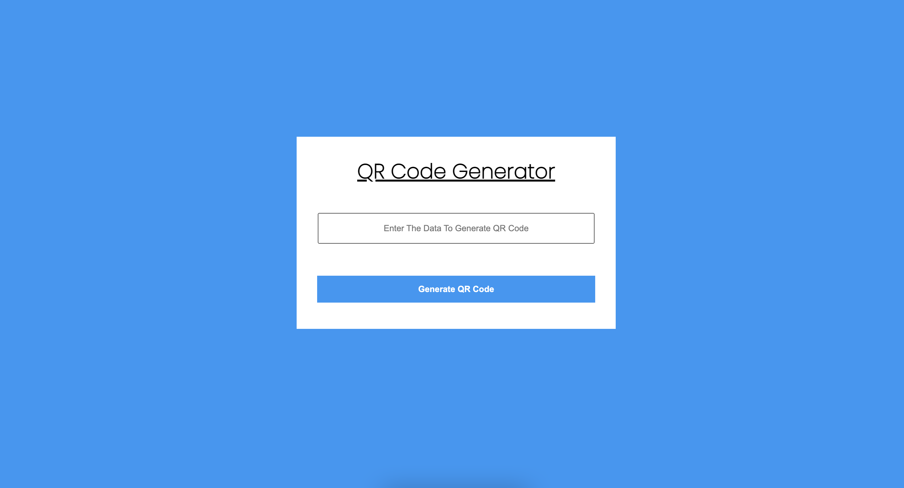

# JavaScript Bootcamp Project : Qr Code API

**By Saurabh**

## [GO LIVE](https://qr-code-api.netlify.app/)

## 

---

## Technologies used

> JavaScript

> HTML

> CSS
---

## **Skill Gained in the project**

- Learn to use DOM manipulation in depth & understand how it important. 
- Learn about Api(Application programming interface) in detail.
- Learn about toggle Animation with css.

## **Time taken to finish this**

- it's Approximately **8 Hour** to understand the concept

---